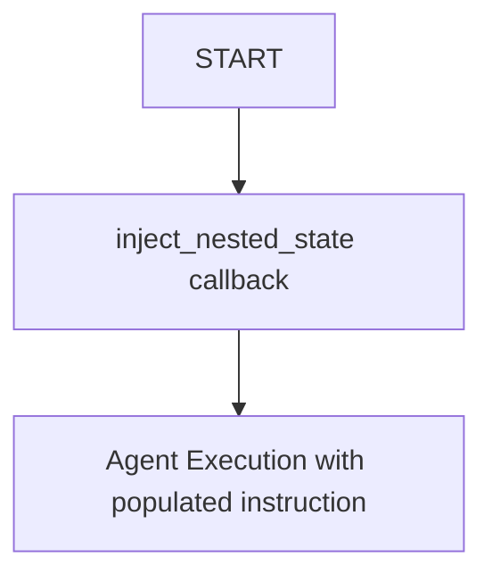

# Nested State Sample

## Overview

This sample demonstrates how to inject nested session state variables and use
optional chaining in agent system instructions.

It shows:

- Accessing nested attributes from dictionary-like state objects (e.g.,
  `{user.profile.role}`).
- Using optional chaining (`?` suffix) to gracefully handle missing keys or
  null values without raising errors (e.g., `{user?.profile?.role?}`).

## Sample Inputs

- `Hello`

  *The agent should respond by greeting you, referencing the name "Jainish" and
  role "Software Engineer" which are injected into the system instruction from
  the callback context state.*

## Graph



## How To

1. **State Initialization**:
   In `agent.py`, the `inject_nested_state` callback is executed before the
   agent runs. It populates the session state with a nested `user` dictionary:

   ```python
   def inject_nested_state(callback_context: Context):
     callback_context.state["user"] = {
         "name": "Jainish",
         "profile": {"age": 24, "role": "Software Engineer"},
     }
   ```

1. **Instruction Template**:
   The agent is defined with a string template for its instruction:

   ```python
   agent = Agent(
       name="nested_state",
       instruction=(
           "Current user is {user?.name?} and {user?.profile?.role?}. Please"
           " greet them by name and designation."
       ),
       before_agent_callback=[inject_nested_state],
   )
   ```

   The ADK framework automatically resolves placeholders like `{user?.name?}`
   from the session state before executing the agent.

1. **Optional Chaining**:
   By using `{user?.name?}` instead of `{user.name}`, the parser will replace
   the placeholder with an empty string if `user` is missing from the state or
   if `name` is missing from `user`, rather than raising a `KeyError`.
